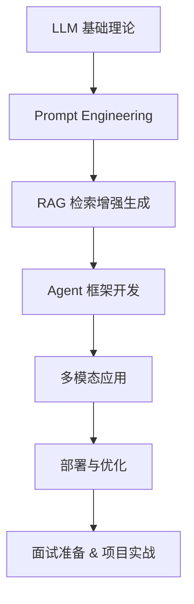

# 🌏 Awesome LLM App Development Roadmap

> 🎯 From zero to building your own AI-powered applications — a complete learning roadmap for **Large Language Model (LLM) Application Development**.  
> 📚 汇总 LLM 应用开发的学习路线、资料、工具、开源项目与面试准备指南，帮助你系统掌握从入门到落地的全流程。

---

## 🧭 目录

---

## 🚀 学习路线总览

## 📘 基础知识与必备技能

## 🧩 应用开发核心模块

## 🧠 工具与框架

## 💡 开源项目精选

## 🧰 开发者资源

## 🎯 职业发展  

- [AI时代的技术抉择：后端开发 vs. 大模型应用开发](https://github.com/summerjava/LLM-App-Dev-4CRUDer/blob/main/%E9%9D%A2%E8%AF%95%E4%B8%8E%E8%81%8C%E4%B8%9A%E5%8F%91%E5%B1%95/AI%E6%97%B6%E4%BB%A3%E7%9A%84%E6%8A%80%E6%9C%AF%E6%8A%89%E6%8B%A9%EF%BC%9A%E5%90%8E%E7%AB%AF%E5%BC%80%E5%8F%91%20vs.%20%E5%A4%A7%E6%A8%A1%E5%9E%8B%E5%BA%94%E7%94%A8%E5%BC%80%E5%8F%91.md)
- [计算机专业想做大模型应用开发，该如何规划](https://github.com/summerjava/LLM-App-Dev-4CRUDer/blob/main/%E9%9D%A2%E8%AF%95%E4%B8%8E%E8%81%8C%E4%B8%9A%E5%8F%91%E5%B1%95/%E8%AE%A1%E7%AE%97%E6%9C%BA%E4%B8%93%E4%B8%9A%E6%83%B3%E5%81%9A%E5%A4%A7%E6%A8%A1%E5%9E%8B%E5%BA%94%E7%94%A8%E5%BC%80%E5%8F%91%EF%BC%8C%E8%AF%A5%E5%A6%82%E4%BD%95%E8%A7%84%E5%88%92.md)

## 🎯 面试

- [大模型工程师八股文](https://github.com/summerjava/LLM-App-Dev-4CRUDer/blob/main/%E9%9D%A2%E8%AF%95%E4%B8%8E%E8%81%8C%E4%B8%9A%E5%8F%91%E5%B1%95/%E5%A4%A7%E6%A8%A1%E5%9E%8B%E5%B7%A5%E7%A8%8B%E5%B8%88%E5%85%AB%E8%82%A1%E6%96%87.md)

---

**如果需要一对一的大模型应用开发（AI Agent开发）的学习路线规划、项目带做、简历修改、面试辅导可以联系我哦：【meta1101】**  

## 📈 贡献与社区

欢迎贡献资源、学习路线或开源项目链接！  
请提交 PR 或在 Issues 中推荐你认为值得加入的内容 🙌
