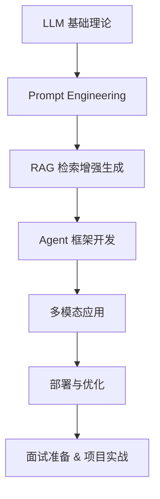

# 🌏 Awesome LLM App Development Roadmap

> 🎯 From zero to building your own AI-powered applications — a complete learning roadmap for **Large Language Model (LLM) Application Development**.  
> 📚 汇总 LLM 应用开发的学习路线、资料、工具、开源项目与面试准备指南，帮助你系统掌握从入门到落地的全流程。

---

## 🧭 目录
- [🚀 学习路线总览](#-学习路线总览)
- [📘 基础知识与必备技能](#-基础知识与必备技能)
- [🧩 应用开发核心模块](#-应用开发核心模块)
- [🧠 工具与框架](#-工具与框架)
- [💡 开源项目精选](#-开源项目精选)
- [🧰 开发者资源](#-开发者资源)
- [🎯 面试与职业发展](#-面试与职业发展)
- [📈 贡献与社区](#-贡献与社区)

---

## 🚀 学习路线总览

## 📘 基础知识与必备技能

## 🧩 应用开发核心模块

## 🧠 工具与框架

## 💡 开源项目精选

## 🧰 开发者资源

## 🎯 面试与职业发展

**如果需要一对一的大模型应用开发（AI Agent开发）的学习路线规划、项目带做、简历修改、面试辅导可以联系我哦：【meta1101】**  

## 📈 贡献与社区

欢迎贡献资源、学习路线或开源项目链接！  
请提交 PR 或在 Issues 中推荐你认为值得加入的内容 🙌
