# 🌏 Awesome Agent Development Roadmap

> 🎯 From zero to building your own AI-powered applications — a complete learning roadmap for **Agent Application Development**.  
> 📚 汇总大模型应用（Agent）开发的学习路线、资料、工具、开源项目与面试准备指南，帮助你系统掌握从入门到落地的全流程。

---

## 🧭 目录

---

## 🚀 学习路线总览

保姆级学习路线（持续更新，跟着学就够了）：  
- [Agent开发保姆级学习路线(知乎)](https://www.zhihu.com/question/1936375725931361485/answer/2010135875586114494)
- [Agent开发保姆级学习路线(公众号)](https://mp.weixin.qq.com/s/SJC7Ok_jcatfyWtzfaKFDw)

## 🧩 学习教程

### 体系化学习课程

- [Agentic_ai系列课程_吴恩达老师](https://github.com/datawhalechina/agentic-ai)
- [Hello Agents_DataWhale社区](https://datawhalechina.github.io/hello-agents/)
- [All in Rag_DataWhale社区](https://datawhalechina.github.io/all-in-rag/)
- [大模型应用开发_DataWhale社区](https://github.com/datawhalechina/llm-universe)
- [ai-agents-for-beginners_微软](https://github.com/microsoft/ai-agents-for-beginners)

### 经典书籍

- [Google agent白皮书](https://github.com/summerjava/LLM-App-Dev-4CRUDer/blob/main/%E5%A4%A7%E6%A8%A1%E5%9E%8B%E5%BA%94%E7%94%A8%E5%BC%80%E5%8F%91-%E5%AD%A6%E4%B9%A0%E8%B5%84%E6%96%99/Google%20Agent%E7%99%BD%E7%9A%AE%E4%B9%A6.pdf)
- [Google agent白皮书中文版](https://github.com/summerjava/LLM-App-Dev-4CRUDer/blob/main/%E5%A4%A7%E6%A8%A1%E5%9E%8B%E5%BA%94%E7%94%A8%E5%BC%80%E5%8F%91-%E5%AD%A6%E4%B9%A0%E8%B5%84%E6%96%99/%5B%E8%AF%91%5D%20AI%20Agent%EF%BC%88%E6%99%BA%E8%83%BD%E4%BD%93%EF%BC%89%E7%99%BD%E7%9A%AE%E4%B9%A6.pdf)
- [Google Agentic-design-patterns中文版.pdf](https://github.com/summerjava/LLM-App-Dev-4CRUDer/blob/main/%E5%A4%A7%E6%A8%A1%E5%9E%8B%E5%BA%94%E7%94%A8%E5%BC%80%E5%8F%91-%E5%AD%A6%E4%B9%A0%E8%B5%84%E6%96%99/agentic-design-patterns-zh-20251011.pdf)
- [Google白皮书-Agent Quality](https://github.com/summerjava/LLM-App-Dev-4CRUDer/blob/main/%E5%A4%A7%E6%A8%A1%E5%9E%8B%E5%BA%94%E7%94%A8%E5%BC%80%E5%8F%91-%E5%AD%A6%E4%B9%A0%E8%B5%84%E6%96%99/Google%205%E6%9C%AC%20%E7%99%BD%E7%9A%AE%E4%B9%A6/Agent%20Quality.pdf)
- [Google白皮书-Agent Tools & Interoperability with Model Context Protocol (MCP)](https://github.com/summerjava/LLM-App-Dev-4CRUDer/blob/main/%E5%A4%A7%E6%A8%A1%E5%9E%8B%E5%BA%94%E7%94%A8%E5%BC%80%E5%8F%91-%E5%AD%A6%E4%B9%A0%E8%B5%84%E6%96%99/Google%205%E6%9C%AC%20%E7%99%BD%E7%9A%AE%E4%B9%A6/Agent%20Tools%20%26%20Interoperability%20with%20Model%20Context%20Protocol%20(MCP).pdf)
- [Google白皮书-Context Engineering_ Sessions & Memory.pdf](https://github.com/summerjava/LLM-App-Dev-4CRUDer/blob/main/%E5%A4%A7%E6%A8%A1%E5%9E%8B%E5%BA%94%E7%94%A8%E5%BC%80%E5%8F%91-%E5%AD%A6%E4%B9%A0%E8%B5%84%E6%96%99/Google%205%E6%9C%AC%20%E7%99%BD%E7%9A%AE%E4%B9%A6/Context%20Engineering_%20Sessions%20%26%20Memory.pdf)
- [Google白皮书-Introduction to Agents.pdf](https://github.com/summerjava/LLM-App-Dev-4CRUDer/blob/main/%E5%A4%A7%E6%A8%A1%E5%9E%8B%E5%BA%94%E7%94%A8%E5%BC%80%E5%8F%91-%E5%AD%A6%E4%B9%A0%E8%B5%84%E6%96%99/Google%205%E6%9C%AC%20%E7%99%BD%E7%9A%AE%E4%B9%A6/Introduction%20to%20Agents.pdf)
- [Google白皮书-Prototype to Production.pdf](https://github.com/summerjava/LLM-App-Dev-4CRUDer/blob/main/%E5%A4%A7%E6%A8%A1%E5%9E%8B%E5%BA%94%E7%94%A8%E5%BC%80%E5%8F%91-%E5%AD%A6%E4%B9%A0%E8%B5%84%E6%96%99/Google%205%E6%9C%AC%20%E7%99%BD%E7%9A%AE%E4%B9%A6/Prototype%20to%20Production.pdf)

### 经典博客文章
- [building-effective-agents_Anthropic](https://www.anthropic.com/engineering/building-effective-agents)

### 入门-Prompt提示词工程

- [Calude文档-提示词工程](platform.claude.com/docs/en/build-with-claude/prompt-engineering/overview)

### 进阶-LangChain / RAG / Vector DB

- [LangChain](https://github.com/langchain-ai/langchain)
- [llama_index](https://github.com/run-llama/llama_index)
- [chroma](https://github.com/chroma-core/chroma)
- [fastapi](https://github.com/tiangolo/fastapi)

### Agent架构实现/实战

- [17+ agentic架构代码实现](https://github.com/FareedKhan-dev/all-agentic-architectures/tree/main)

### Skills

- [OAnthropic官方Skills](https://github.com/anthropics/skills)
- [Superpowers](https://github.com/obra/superpowers)
- [Planning-with-files](https://github.com/OthmanAdi/planning-with-files)
- [Planning-with-files](https://github.com/OthmanAdi/planning-with-files)

### Vibe-Coding

- [首个系统化 Vibe Coding 开源教程](https://github.com/datawhalechina/vibe-vibe)

## 🧰 经典入门案例

- [50行Python代码实现Rag应用](https://github.com/summerjava/LLM-App-Dev-4CRUDer/tree/main/%E5%A4%A7%E6%A8%A1%E5%9E%8B%E5%BA%94%E7%94%A8%E5%BC%80%E5%8F%91-%E7%BB%8F%E5%85%B8%E5%85%A5%E9%97%A8%E6%A1%88%E4%BE%8B/50%E8%A1%8CPython%E4%BB%A3%E7%A0%81%E5%AE%9E%E7%8E%B0Rag%E5%BA%94%E7%94%A8)

## 🎯 职业发展  

- [AI时代的技术抉择：后端开发 vs. 大模型应用开发](https://github.com/summerjava/LLM-App-Dev-4CRUDer/blob/main/%E9%9D%A2%E8%AF%95%E4%B8%8E%E8%81%8C%E4%B8%9A%E5%8F%91%E5%B1%95/AI%E6%97%B6%E4%BB%A3%E7%9A%84%E6%8A%80%E6%9C%AF%E6%8A%89%E6%8B%A9%EF%BC%9A%E5%90%8E%E7%AB%AF%E5%BC%80%E5%8F%91%20vs.%20%E5%A4%A7%E6%A8%A1%E5%9E%8B%E5%BA%94%E7%94%A8%E5%BC%80%E5%8F%91.md)
- [计算机专业想做大模型应用开发，该如何规划](https://github.com/summerjava/LLM-App-Dev-4CRUDer/blob/main/%E9%9D%A2%E8%AF%95%E4%B8%8E%E8%81%8C%E4%B8%9A%E5%8F%91%E5%B1%95/%E8%AE%A1%E7%AE%97%E6%9C%BA%E4%B8%93%E4%B8%9A%E6%83%B3%E5%81%9A%E5%A4%A7%E6%A8%A1%E5%9E%8B%E5%BA%94%E7%94%A8%E5%BC%80%E5%8F%91%EF%BC%8C%E8%AF%A5%E5%A6%82%E4%BD%95%E8%A7%84%E5%88%92.md)

## 🎯 面试

- [大模型工程师八股文](https://github.com/summerjava/LLM-App-Dev-4CRUDer/blob/main/%E9%9D%A2%E8%AF%95%E4%B8%8E%E8%81%8C%E4%B8%9A%E5%8F%91%E5%B1%95/%E5%A4%A7%E6%A8%A1%E5%9E%8B%E5%B7%A5%E7%A8%8B%E5%B8%88%E5%85%AB%E8%82%A1%E6%96%87.md)

## 优秀开源项目

### OpenClaw🦞

- [阿里云-部署OpenClaw（原Moltbot、Clawdbot）镜像](https://help.aliyun.com/zh/simple-application-server/use-cases/quickly-deploy-and-use-openclaw?spm=a2c4g.11186623.0.i3)
- [Youtube视频-OpenClaw Full Tutorial for Beginners – How to Set Up and Use OpenClaw (ClawdBot / MoltBot)](https://www.youtube.com/watch?v=n1sfrc-RjyM)

### OpenCode

开源版ClaudeCode。

- [Opencode官方文档](https://opencode.ai/docs/zh-cn/)
- [OpenCode中文实战课](https://learnopencode.com/)

## Agent开发工业界落地案例

- [基于AI大模型的故障诊断与根因分析落地实现](https://mp.weixin.qq.com/s/AYenvVpB-oHWabJFbkUpmg)

## 热门AI工具

- [开源项目阅读利器-DeepWiki](https://deepwiki.com/)

### Claude Code

- [Claude官方文档-Agent SDK](https://platform.claude.com/docs/en/agent-sdk/overview)

### SeeDance 2.0

- [🎬 即梦 Seedance 2.0 使用手册（全新多模态创作体验）](https://bytedance.larkoffice.com/wiki/A5RHwWhoBiOnjukIIw6cu5ybnXQ)

### Nano Banana

- [Nano Banana 图片生成-Google官方文档](https://ai.google.dev/gemini-api/docs/image-generation?hl=zh-cn)
- [Nano Banana 超完整攻略：一篇搞懂 Google 殺手級 AI 繪圖](https://blog.creatorhome.tw/nano-banana/)

---

**如果需要一对一的大模型应用开发（AI Agent开发）的学习路线规划、项目带做、简历修改、面试辅导可以联系我哦：【meta1101】**  

辅导案例：

## 📈 贡献与社区

欢迎贡献资源、学习路线或开源项目链接！  
请提交 PR 或在 Issues 中推荐你认为值得加入的内容 🙌
